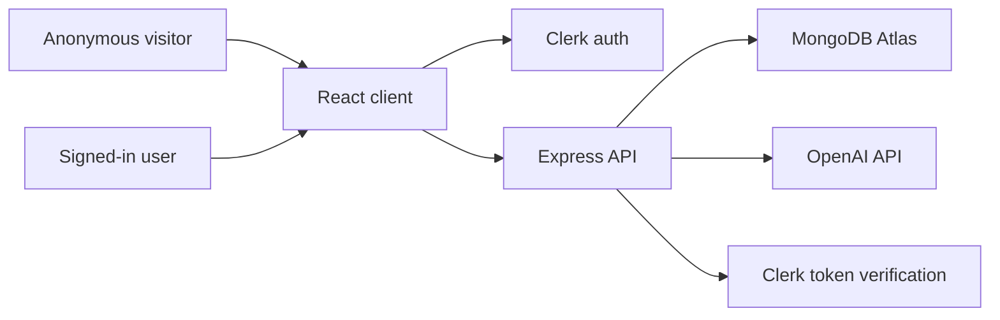
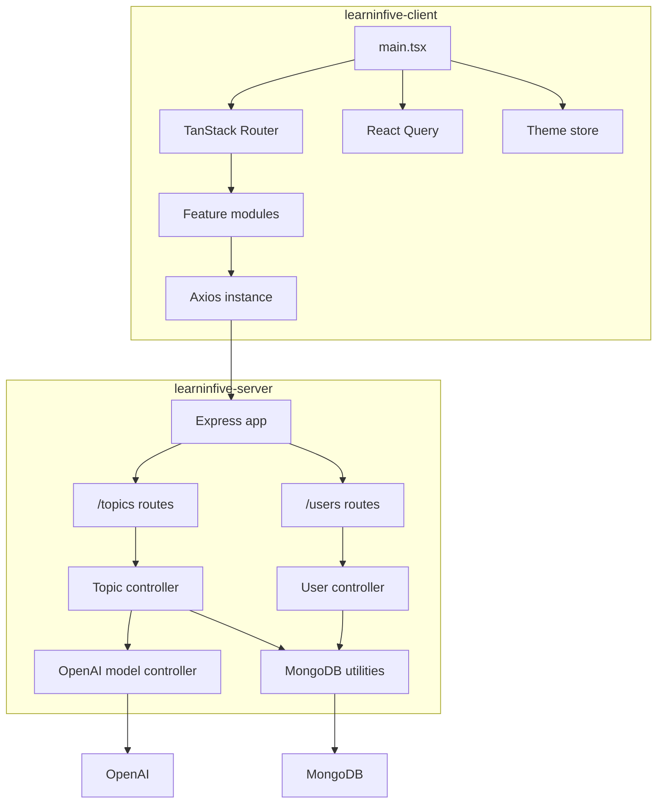
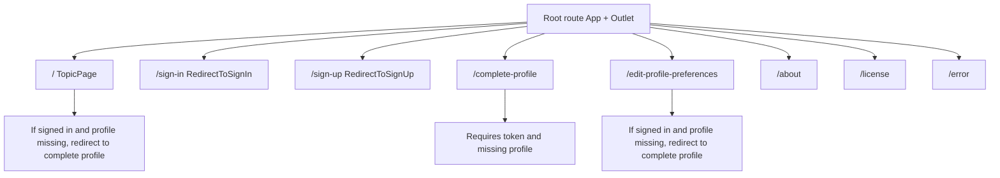
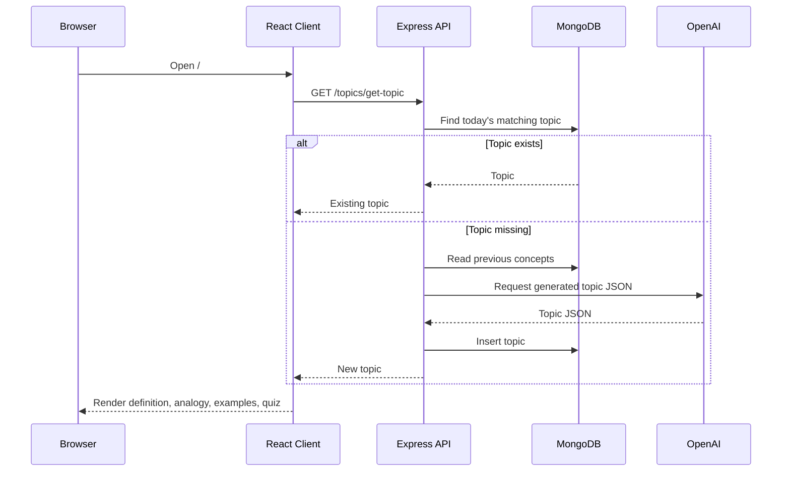
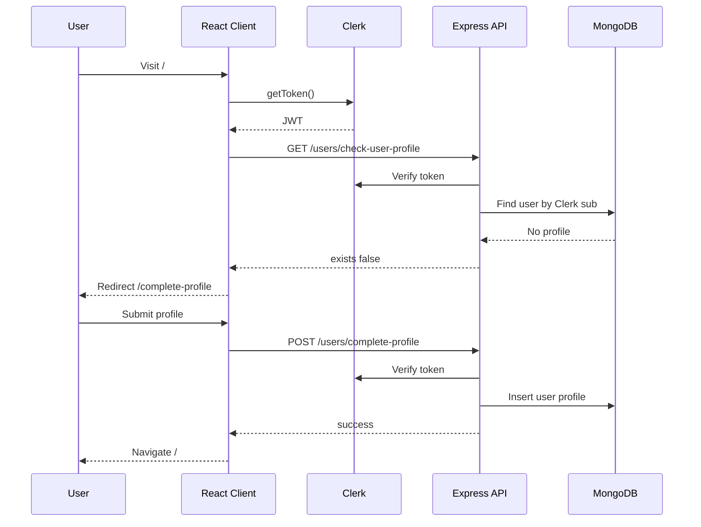
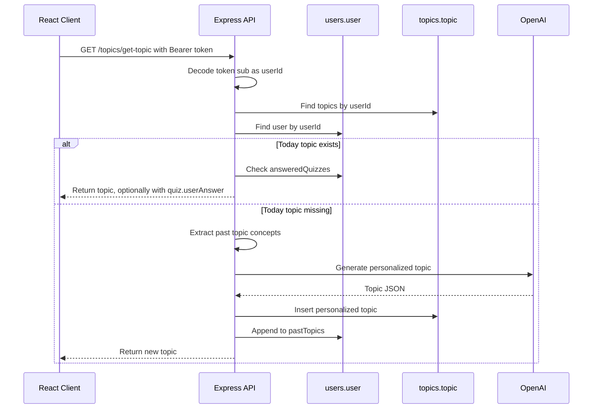
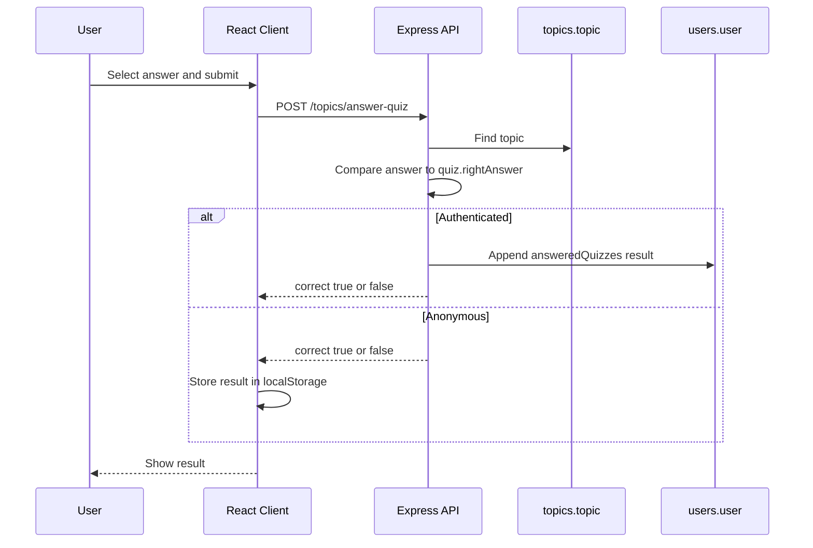
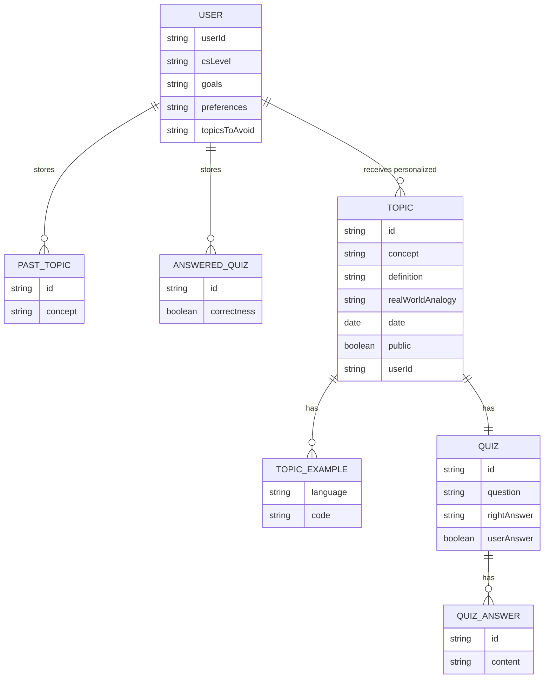
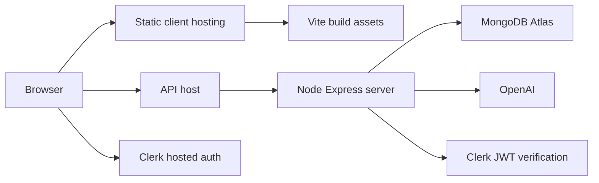

# Diagrams

These diagrams use Mermaid syntax and can be rendered by GitHub, many Markdown editors, and Mermaid CLI.

## System Context

## Runtime Architecture

## Client Route Map

## Topic Request Sequence

## Authenticated Profile Completion

## Personalized Topic Generation

## Quiz Answer Flow

## Data Relationships

## Deployment Shape

